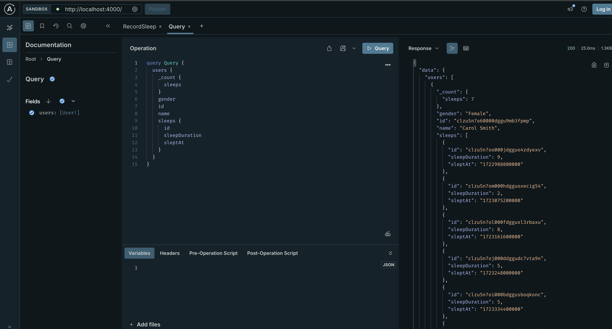
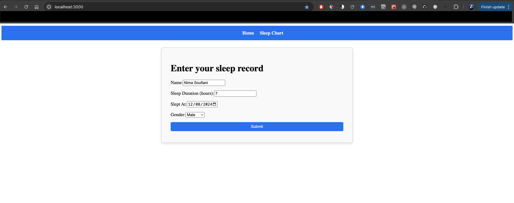
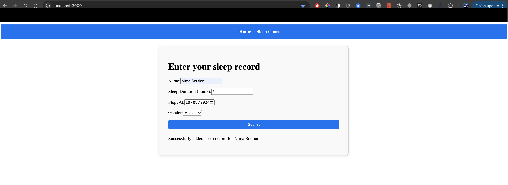
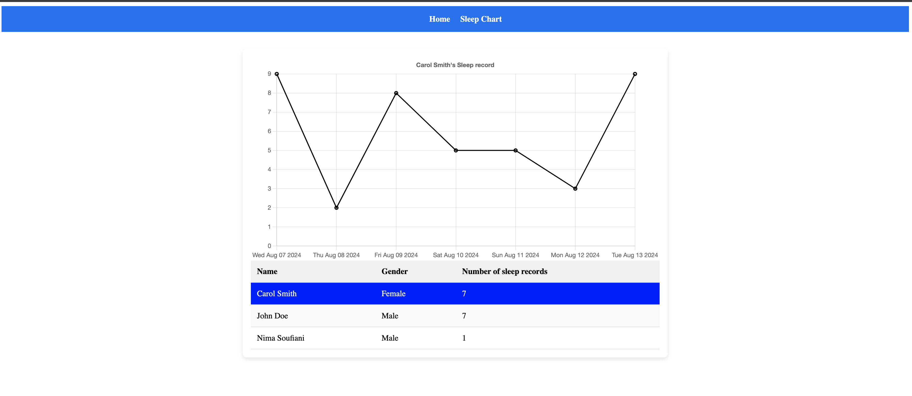
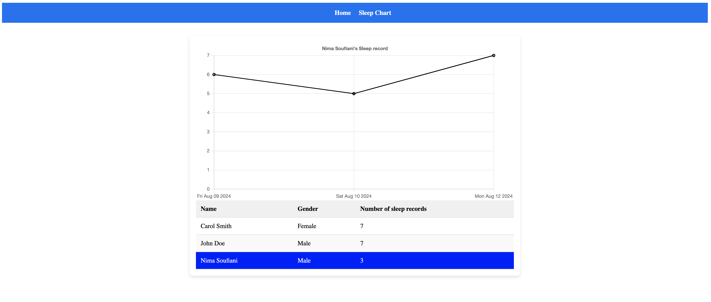

# Project Name

## Table of Contents
- [Project Name](#project-name)
  - [Table of Contents](#table-of-contents)
  - [Introduction](#introduction)
  - [Application](#application)
  - [Tech Stack](#tech-stack)
    - [Backend](#backend)
    - [Frontend](#frontend)
  - [Directory Structure](#directory-structure)
  - [Getting Started](#getting-started)
    - [Backend](#backend-1)
    - [Frontend](#frontend-1)
  - [Seeding the Database](#seeding-the-database)
    - [Notes](#notes)
    - [Why This Tech Stack](#why-this-tech-stack)
    - [Future Enhancements](#future-enhancements)

## Introduction
This is a full-stack project built using Node.js and TypeScript. The backend is a GraphQL server built with Apollo Server, TypeScript, and Prisma ORM, while the frontend is a Next.js application that interacts with the backend using Apollo Client. The project is fully containerized using Docker Compose, making it easy to set up and run in any environment.

## Application


You'll see the GraphQL server on http://localhost:4000


You'll see the frontend web app on http://localhost:3000 . Fill in the information and submit


When you click on Sleep Chart


You'll see rows of users. Click on a user to see their last 7 day entries on the chart



## Tech Stack

### Backend
- **Node.js**: JavaScript runtime environment
- **TypeScript**: Superset of JavaScript that adds static typing
- **Apollo Server**: GraphQL server implementation
- **Prisma**: ORM for database interaction
- **SQLite**: Database for local development

### Frontend
- **Next.js**: React framework with server-side rendering
- **TypeScript**: Superset of JavaScript that adds static typing
- **Apollo Client**: GraphQL client for React applications
- **Codegen**: Generates TypeScript types from GraphQL schema

## Directory Structure

```bash
/backend
├── src/
├── prisma/
├── Dockerfile
├── package.json
└── tsconfig.json
/frontend
├── pages/
├── components/
├── Dockerfile
├── package.json
└── tsconfig.json
README.md
```

## Getting Started

###  Backend
1 - Navigate to the backend directory:
```bash
cd backend
```
2 - Install dependencies:
```bash
yarn install
```
3 - Generate Prisma client:
```bash
npx prisma generate
```
4 - Apply migrations:
```bash
npx prisma migrate dev
```
5 - Start the development server:
```bash
yarn run dev
```
### Frontend
1 - Navigate to the frontend directory:
```bash
cd frontend
```
2 - Install dependencies:
```bash
yarn install
```
3 - Start the development server:
```bash
yarn dev
```
## Seeding the Database

cd into backend directory
```bash
yarn run seed
```


### Notes
Docker compose method currently has a bug and fix is being worked on.
Tests are not complete yet but are currently being worked on.
Consider adding CI/CD pipelines to automate testing and deployment.
Explore using other databases for production environments.
### Why This Tech Stack
I chose this tech stack for several reasons:

* TypeScript: Provides strong typing, which helps catch errors early in the development process.
* GraphQL with Apollo: Enables flexible and efficient data fetching. It allows the frontend to request only the data it needs.
* Prisma ORM: Simplifies database access and migrations, and it integrates well with TypeScript.
* Next.js: Offers server-side rendering, which improves performance and SEO for the frontend.
* Docker Compose: Simplifies the setup process by containerizing the frontend and backend, ensuring a consistent development environment.

### Future Enhancements
* Fix docker compose
* Complete the testing suite for both backend and frontend.
* Add user authentication and authorization.
* Implement CI/CD pipelines.
* Optimize Dockerfile for smaller image sizes.
* Better exception handling through try catch
* Returning useful error types to frontend. Example: if user somehow manages to send a future date for sleep record, a useful error message should form part of the GraphQL response.